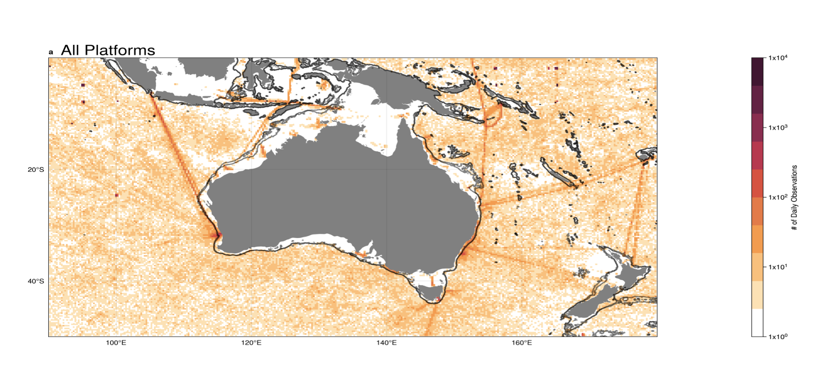

# Can the AODN help us fill in key data gaps in the Australian EEZ / region?

Work done by [@ChrisC28](https://github.com/ChrisC28) & [@BecCowley](https://github.com/BecCowley) has identified gaps in even the most common baseline ocean observations ( temperature & salinity ) over all time for large areas of the Australian EEZ / region in state-of-the-art global databases like the [WOD](https://www.ncei.noaa.gov/products/world-ocean-database).

For example this preliminary plot from [@ChrisC28](https://github.com/ChrisC28) shows the lack of any observations in the WOD for much of the Australian shelf & coast over all time. And regions with coverage may still suffer from seasonal aliasing?

## But are we missing local Australian data holdings not in WOD?
Important considerations for using the AODN could include:

How can we search across all observations and all platforms and over all time in these specific regions?
Does AODN data have any flags or metadata on what is / is not in the WOD or other global databases?
If we can identify observations not seen in the WOD can we make that selection across all platforms and grab a single data object with rich metadata on it's provenance?
Double checking for any duplication in WOD data already available.

# 2024 AODN hackathon

## Where we'd like to be - are we already there?

1. a data pipeline for ocean observations that works with python tools on any laptop, supercomputer, or cloud instance.
2. a searchable catalog of all data that can be filtered by variable, platform/instrument type, time, space, WOD inclusion, other metadata.
3. returning a lazy object with rich metadata - provenance, QC, in/out WOD
4. returning a lazy object in `xarray`? `pandas` dask dataframe? `parquet`?

`my_data = get_aodn(variable='temperature',time=(2005-01,2018-12),latitude=(-40,-20),longitude=(140,180),WOD='False')`

#### Goals:

- What backend service is future-proof for AODN services? (`s3`?)
- What is a MVP we can build now to show the promise of this capability? XBT? CTD? Combination?
- Identify any gaps and barriers at the AODN level that could be addressed with time to enable this for **all** ocean observations in the archive?

