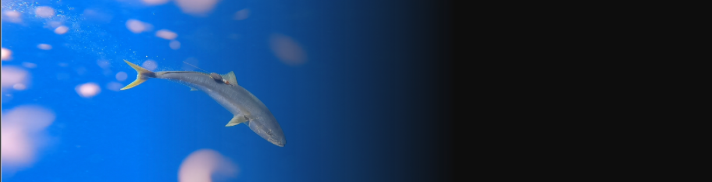
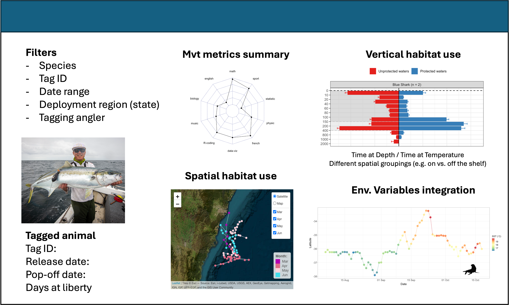
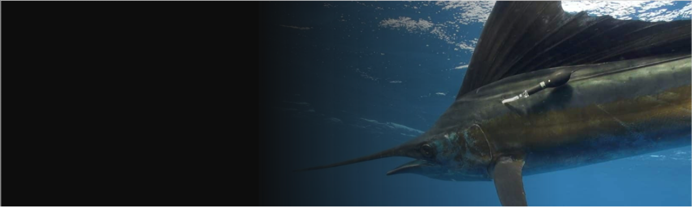

# Fish-DAT: Integrating IMOS observations with animal tracking datasets to elucidate the spatial ecology of fishery-important species

 

 

Tracking studies offer important insights into the behaviour and movement patterns of important fishery species. The data obtained using 
satellite tags (e.g., PSATs, GPS, ARGOS) can reveal patterns of species movements as they move between coastal and offshore habitats, 
delineating the boundaries of their ecological niches. Additionally, movement data can elucidate the critical overlap between fish 
migration routes and fishing activities. One remaining gap in these analyses is the integration of oceanographic observations with satellite tracking
datasets to understand environmental influences on habitat use patterns. 

This project seeks to develop R-based tools to enable interactive movement analysis, and more importantly, integrating IMOS oceanographic
datasets with movement data. 

The key desirable outcomes of this tool may include:

+ Interactive data visualization dashboards
+ Analysis of movement patterns in 2D and/or 3D
+ Calculation of movement metrics
+ Evaluating habitat characteristics 
+ Assessing overlap with threatening processes (e.g., Fishing effort)

  

A potential example dashboard could look something like this:

  

