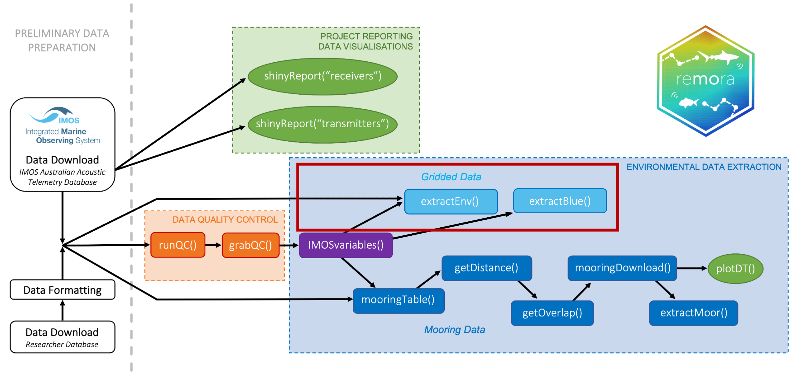
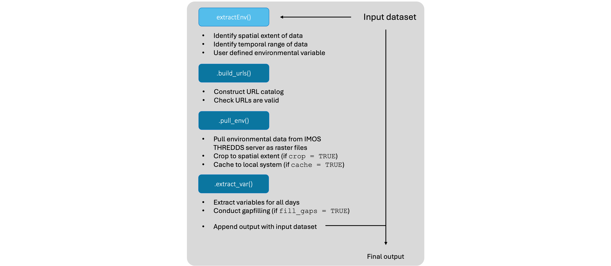
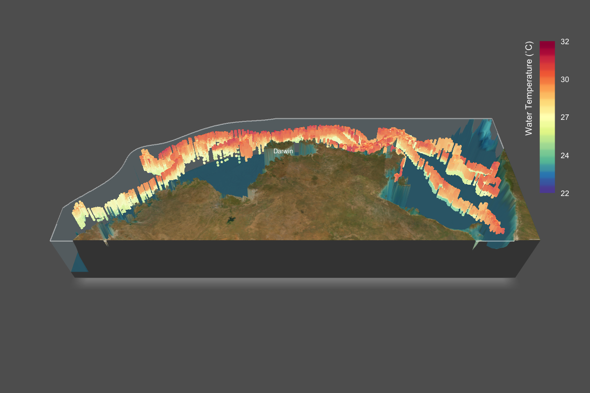

------------------------------------------------------------------------

## Introduction

In this tutorial we will go through some features of the [**`remora`**](https://github.com/IMOS-AnimalTracking/remora) R package that allows users to conduct a number of analyses when working with animal tracking or occurrence datasets. Here we won't cover all the features of the package, but will go through one of the workflows that may be useful for some of the projects you are working on this week.

------------------------------------------------------------------------

### The `remora` R package

The **`remora`** R package was developed by a multi-institutional team led by Fabrice Jaine from IMOS to allow users of the IMOS Animal Tracking Facility (and the wider animal tracking community) to be able to quickly and easily conduct quality control checks on their data, and allow easy access to other remote sensing and in situ data collected and managed by IMOS.

**`remora`** is an R package enabling the integration of animal acoustic telemetry data with oceanographic observations collected by ocean observing programs. It includes functions for:

-   Interactively exploring animal movements in space and time from acoustic telemetry data
-   Performing robust quality-control of acoustic telemetry data as described in [Hoenner et al. 2018](https://doi.org/10.1038/sdata.2017.206)
-   Identifying available satellite-derived and sub-surface *in situ* oceanographic datasets coincident and collocated with the animal movement data, based on regional Ocean Observing Systems
-   Extracting and appending these environmental data to animal movement data

Whilst the functions in remora were primarily developed to work with acoustic telemetry data, the environmental data extraction and integration functionalities will work with other spatio-temporal ecological datasets (eg. satellite telemetry, species sightings records, fisheries catch records).



In this tutorial we will work specifically with the `extractEnv()` function.

<br>

------------------------------------------------------------------------

### Installing `remora` and other useful packages for this tutorial

Lets Install some key packages that we will use for these to manipulate, analyse and visualise data. The code below also installs all the dependency packages, so may take a while. If you are using **RStudio**, you will only need to run this once if you dont already have these packages installed on your system.

```{r, message = F, eval = F}
## Installing standard R packages
install.packages(c("tidyverse",
                   "sf",
                   "mapview",
                   "terra",
                   "scales",
                   "remotes"), 
                 dependencies = TRUE)


## We will now use the `remotes` package to install `remora` from the Github page
remotes::install_github('IMOS-AnimalTracking/remora', build_vignettes = TRUE, dependencies = TRUE)

```

------------------------------------------------------------------------

## Using `remora` to append IMOS environmental data to occurrence data

The `imos_variables()` function will help the user identify currently available environmental layers that can be accessed and associated. Variables include spatial layers including `bathy` and `dist_to_land`, which provide distance measures of bathymetry (in meters) and proximity to land (in kilometers). Variable names that start with `rs_` are remotely-sensed or gridded environmental layers and variables starting with `moor_` include *in situ* sub-surface mooring environmental layers. A new feature of `remora` is additional capacity to access gridded environmental layers from the Bluelink dataset (BRAN). These variable names start with `ocean_` and provides daily modeled oceanographic variables at different depths from the surface to 4,509 m in depth.

```{r, warning = FALSE}
library(remora)

imos_variables()

```

------------------------------------------------------------------------

### Using `extractEnv()` function

In this first example, we will extract the variable *Interpolated sea surface temperature* and append it to the 'fish_occurrence' dataset.

Environmental variable can only be accessed one at a time using the `extractEnv()` function. There are a few parameters within the function that can help the user identify the variable required, and to manage the downloaded environmental layers:

```{=html}
<style>
div.blue { background-color:#e6f0ff; border-radius: 5px; padding: 20px;}
</style>
```
::: blue
-   **df**: the data frame with the detection data
-   **X**: the name of the column with longitude for each detection
-   **Y**: the name of the column with latitude for each detection
-   **datetime**: the name of the column with the date-timestamp for each detection
-   **env_var**: the name of the environmental variable to download and append (see `imos_variables()` for available variables and variable names)
-   **cache_layers**: should the extracted environmental data layers be cached within the working directory? If so, spatial layers will be cached within a folder called `imos.cache` within your working directory.
-   **crop_layers**: should the extracted environmental data be cropped to within the study site? reduces the file size of downloaded files
-   **full_timeperiod**: should environmental variables extracted for each day across full monitoring period, if set to `TRUE` it can be time and memory consuming for long projects
-   **folder_name**: name of folder within `imos.cache` where downloaded rasters should be saved. If none provided automatic folder names generated based on study extent
-   **.parallel**: should the function be run in parallel? speeds up environmental extraction for large datasets
-   **nrt**: should Near-Real Time data be used if Delayed Mode data is not available?
:::

<br><br>

The `extractEnv()` function was designed to take in minimal input data (i.e., latitude, longitude, date) to be able to extract and append user defined environmental data stored and maintained on the AODN THREDDS server. In most cases, delayed-mode datasets are prefered, but if DM data is not available for the time period, Near-Real Time data can be accessed instead. Although a lot of the other functions in this package were created specifically to handle Acoustic Telemetry datasets, this function was generalised so it can be used for other datasets that require temporally and spatially variable environmental data exraction.



<br>

------------------------------------------------------------------------

### Fish in hot water!

Lets start with a simple example using a dataset of occurrences of three species of fish along the East coast of Australia. This dataset was collated from the [***Atlas of Living Australia***](https://www.ala.org.au). The dataset consists of occurrence records of Common Coral Trout (*Plectropomus leopardus*), Snapper (*Chrysophrys auratus*) and Spangled Emperor (*Lethrinus nebulosus*) between 2011 and 2024.

Each occurrence point here is associated with a source of the occurrence record, geographic coordinates (longitude and latitude) and a date that the occurrence was recorded. Before we start extracting IMOS data for these records, lets have a look at it closer.

```{r, message=F, out.width = '100%'}
library(tidyverse)
library(sf)
library(mapview)

## Species Occurrence dataset
fish_occurrence <- read_csv("data/Fish_occurrence.csv", show_col_types = FALSE)

## Data to plot land
land <- map_data("world") 


## Using ggplot to visualise the data
fish_occurrence %>% 
  ggplot(aes(x = longitude, y = latitude, col = common_name)) +
  geom_polygon(data = land, aes(x = long, y = lat, group = group), 
               fill = "grey", inherit.aes = F) +
  geom_point() +
  coord_equal(xlim = c(142, 160), ylim = c(-43, -9)) +
  labs(x = NULL, y = NULL, col = "Species") +
  theme_bw()


## Lets use the `sf` and `mapview` to interactively plot these data
fish_occurrence %>% 
  st_as_sf(coords = c("longitude", "latitude"), crs = 4326) %>% 
  mapview(zcol = "common_name")

```

<br>

Using the example `fish_occurrence` data, lets extract sea surface temperature data to explore the thermal niches of multiple fish species:

```{r, warning = F, message = F, eval = F}
## This can take a lot of time (over 40 mins sometimes!), 
## so lets just run a small subset during the tutorial!

fish_env <-
  fish_occurrence %>% 
  # slice(5:7) %>%
  extractEnv(X = "longitude",
             Y = "latitude", 
             datetime = "date",
             env_var = "rs_sst_interpolated",
             cache_layers = F,
             fill_gaps = T,
             full_timeperiod = F, 
             .parallel = F)

```

<br>

#### Visualising data appended SST data for occurrences

Since we have limited time, and cant let the function run for the full dataset, here is what it looks like if you let it run and append Interpolated SST data for the full dataset:

```{r, warning = F, message = F, out.width = '100%'}
## Lets load up the dataset I prepared earlier!
fish_sst <- read_csv("data/fish_sst.csv", show_col_types = FALSE)

## Lets map the data interactively
fish_sst %>% 
  st_as_sf(coords = c("longitude", "latitude"), crs = 4326) %>% 
  mapview(zcol = "rs_sst_interpolated")

## Splitting the data by species
fish_sst %>% 
  ggplot(aes(x = longitude, y = latitude, color = rs_sst_interpolated)) +
  geom_polygon(data = land, aes(x = long, y = lat, group = group), 
               fill = "grey", inherit.aes = F) +
  geom_point() +
  coord_equal(xlim = c(142, 160), ylim = c(-43, -9)) +
  scale_color_viridis_c() +
  scale_fill_viridis_c(option = "B") +
  labs(x = NULL, y = NULL, col = "SST Interpolated (˚C)") +
  facet_wrap(~common_name, nrow = 1) +
  theme_bw()

```

Apart from the spatial plotting of the data, we can try and look at how the thermal niche of these species differ:

```{r, warning = F, out.width = '100%'}
library(patchwork)

a <- 
  fish_sst %>% 
  ggplot(aes(x = rs_sst_interpolated, y = fct_rev(common_name), fill = common_name)) +
  geom_boxplot(show.legend = FALSE, alpha = 0.5) +
  scale_fill_viridis_d() +
  theme_void()

b <-
  fish_sst %>% 
  ggplot(aes(x = rs_sst_interpolated, fill = common_name)) +
  geom_histogram(alpha = 0.5, position = "identity", bins = 40) +
  scale_fill_viridis_d() +
  labs(x = "SST Interpolated (˚C)", y = "Count", fill = "Common Name") +
  theme_bw() + theme(legend.position = "inside", legend.position.inside = c(0.15, 0.8))

(a/b) + plot_layout(ncol = 1, heights = c(0.1, 1))


```

<br><br>

------------------------------------------------------------------------

### Turtles and currents

In the second example, we will use the `extractEnv()` function to append current data to animal tracking datasets. Here we will use data from GPS CTD tags deployed on Flatback Turtles (*Natator depressus*) from a key rookery on Gurriba Island in the Crocodile Islands Group (Milingimbi) in the Northern Territory. Female turtles were tagged once they finished nesting on the island, and conducted their post-nesting migratinos to key foraging grounds across Northern Australia. The tags collected profile data on temperature and salinity as the turtles dived, and transmitted data via FastLock GPS.

<br>



For this example, lets use a subset of this data and append ocean current data to the tracks to understand if these turtles passively drift with the current or actively swim against them:

```{r, warning = F, message = F}
turtle_tracks <- read_csv("Data/Turtle_tracks.csv", show_col_types = FALSE)

```

Lets explore the track data by plotting it

```{r, warning = F, message = F, out.width = '100%'}
## quick interactive plot
turtle_tracks %>% 
  st_as_sf(coords = c("lon", "lat"), crs = 4326) %>% 
  mapview(zcol = "id")

 
## static plot
turtle_tracks %>% 
  ggplot(aes(x = lon, y = lat, color = id, group = id)) +
  geom_polygon(data = land, aes(x = long, y = lat, group = group), fill = "grey", inherit.aes = F) +
  geom_point(cex = 0.5) +
  geom_path() +
  coord_equal(xlim = c(120, 145), ylim = c(-19, -8)) +
  scale_color_viridis_d() +
  labs(x = NULL, y = NULL, col = "Turtle Name") +
  theme_bw()

```

We can use the `extractEnv()` function to append current data to the tracking data. In the code below we will also cache layers to your system, so you can access the gridded datasets locally for plotting or further analysis. We will also ask the function to look for Near-Real Time data if Delayed-mode data is unavailable:

```{r, eval = F, message = F}
## Again, this will take a while so I suggest not running this during the tutorial

turtle_curr <-
  turtle_tracks %>%
  # slice(1:6) %>%
  extractEnv(
    X = "lon",
    Y = "lat",
    datetime = "date",
    env_var = "rs_current",
    cache_layers = T,
    folder_name = "turtle",
    fill_gaps = T,
    full_timeperiod = F,
    .parallel = F,
    nrt = TRUE,
    output_format = ".tif"
  )

```

The extraction of current data here will append 3 datasets to each position:

-   Gridded Sea Level Anomoly ('rs_gsla')
-   Surface Geostrophic velocity east-west ('rs_ucur')
-   Surface Geostrophic velocity north-south ('rs_vcur')

In addition to this, the function also uses these variables to calculate current velocity ('rs_current_velocity') and current bearing ('rs_current_bearing')

```{r, warning = F, message = F}
## Lets load up the data I ran earlier

turtle_curr <- read_csv("data/turtle_curr.csv", show_col_types = FALSE)

```

<br><br>

#### Visualise the extracted data and the pulled GSLA data

Now that we have extracted the current data, lets visualise the tracking data with the downloaded GSLA data:

```{r, warning = F, message = F, out.width = '100%'}
library(terra)
library(scales)

gsla <- rast("data/rs_gsla.tif")

plot(gsla)

```

```{r, warning = F, message = F, out.width = '100%'}
## Plot the gridded data with the tracks

# convert the gridded data into a dataframe to plot
gsla_df <- 
  as.data.frame(gsla, xy = TRUE) %>% 
  pivot_longer(col = -c(1:2), names_to = "rs_date", values_to = "gsla")

turtle_curr %>% 
  ggplot(aes(x = lon, y = lat, color = id, group = id)) +
  geom_raster(data = gsla_df, aes(x = x, y = y, fill = gsla, group = rs_date), inherit.aes = F) +
  geom_polygon(data = land, aes(x = long, y = lat, group = group), fill = "grey", inherit.aes = F) +
  geom_point(cex = 0.5) +
  geom_path() +
  coord_equal(xlim = c(120, 145), ylim = c(-19, -8)) +
  scale_color_viridis_d() +
  facet_wrap(~rs_date) +
  labs(x = NULL, y = NULL, col = "Turtle Name") +
  theme_bw()


```

```{r, warning = F, message = F, out.width = '100%'}
## Plotting this interactively

turtle_curr %>% 
  st_as_sf(coords = c("lon", "lat"), crs = 4326) %>% 
  mapview(zcol = "rs_current_velocity", layer.name = "Current Velocity") +
  mapview(gsla[[1]], layer.name = "GSLA")

```

We can also look at how the direction and velocity of the surface currents affected the turtles along their migration path:

```{r, warning = F, message = F, out.width = '100%'}

## We first need to convert the current bearing into an angular degree 
## and radius for the forthcoming ggplot geom_spoke() plot

turtle_curr <-
  turtle_curr %>% 
  mutate(degree_angle = (450 - rs_current_bearing) %% 360,
         radius = degree_angle*pi/180)


## Plotting the current direction and velocity for each position over time
turtle_curr %>% 
  ggplot(aes(x = date, y = id, color = rs_current_velocity)) +
  geom_point() +
  geom_spoke(aes(x = date, y = id, angle = degree_angle, radius = radius),
             arrow = arrow(length = unit(0.05, 'inches')), lwd = 0.5) +
  labs(x = NULL, y = NULL, col = "Current Velocity (m/s)") +
  scale_x_date(date_breaks = "1 month", date_labels = "%b") +
  scale_color_viridis_c() +
  theme_bw()


## Mapping the current direction and velocity along each turtle track
turtle_curr %>% 
  ggplot(aes(x = lon, y = lat, color = rs_current_velocity, group = id,
             angle = degree_angle, radius = rescale(radius, 1, 1.5))) +
  geom_polygon(data = land, aes(x = long, y = lat, group = group), 
               fill = "grey", inherit.aes = F) +
  geom_point() +
  geom_path() +
  geom_spoke(arrow = arrow(length = unit(0.05, 'inches')), lwd = 0.5) +
  coord_equal(xlim = c(120, 145), ylim = c(-19, -8)) +
  scale_color_viridis_c() +
  scale_fill_viridis_c(option = "B") +
  labs(x = NULL, y = NULL, col = "Current Velocity (m/s)") +
  facet_wrap(~id, ncol = 1) +
  theme_bw()


```

------------------------------------------------------------------------
